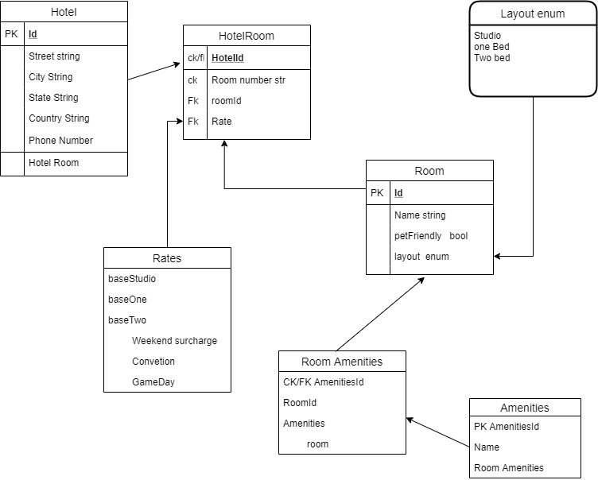

# AsyncHotel
Stay Asynchronously!

- Entity Relationship Diagram

Entities
- Hotel: establishes the Id and location of the hotel
- HotelRoom: A Join Table made up of RoomId, HotelId, and Rate
- Rates: a table showing the different base rates and surgcharges add for diffrent days
  - I should probably break that down further into more tables
- Room: Sets up the name, layout, and whether or not it is pet friendly
 - layout relates to an enum 
- Room Amenities: describes the amenities for a room
- Amenities: lists the amenities